# TalePick Folder Structure Design

> **Next.js 16 Monorepo** • Clean Architecture • Shared API Layer • MongoDB • 2025

---

## 📁 Root Directory Structure

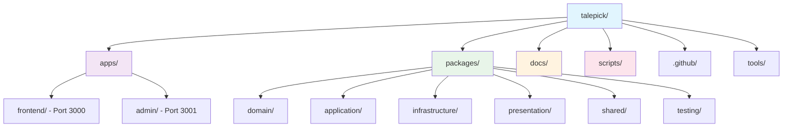

---

## 🏗️ Clean Architecture Overview

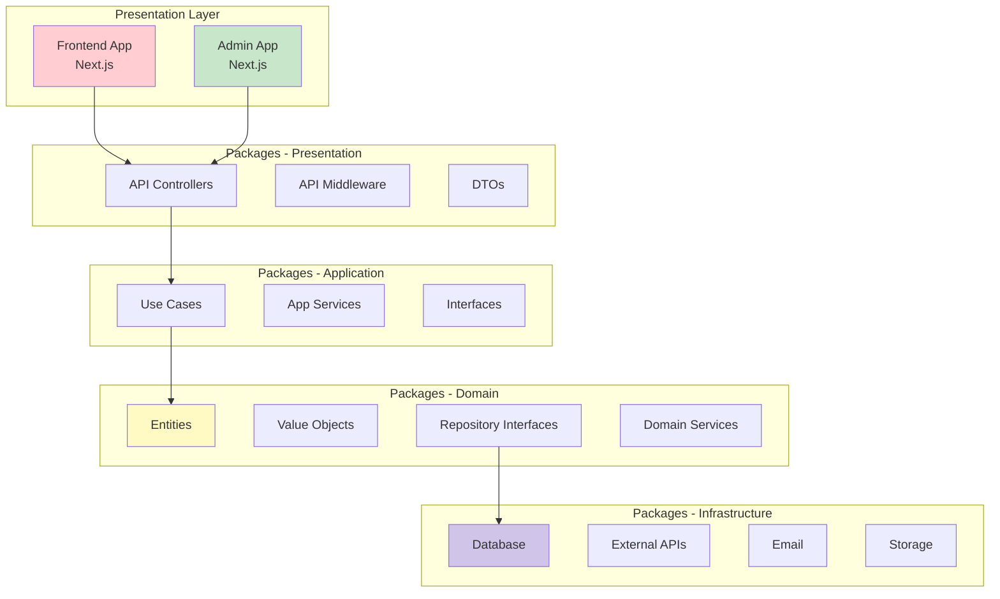

---

## 📂 Apps Structure

### Frontend App (`/apps/frontend/`)

```mermaid
graph LR
    A[apps/frontend/] --> B[public/]
    A --> C[app/]
    A --> D[test/]

    C --> C1[layout.tsx]
    C --> C2[page.tsx]
    C --> C3[(auth)/]
    C --> C4[(story)/]
    C --> C5[lib/]
    C --> C6[ui/]
    C --> C7[api/]

    C3 --> C3a[login/]
    C3 --> C3b[signup/]
    C3 --> C3c[forgot-password/]

    C4 --> C4a[library/]
    C4 --> C4b[play/]

    C7 --> C7a[auth/]
    C7 --> C7b[stories/]
    C7 --> C7c[users/]

    style A fill:#e3f2fd
```

### Admin App (`/apps/admin/`)

```mermaid
graph LR
    A[apps/admin/] --> B[public/]
    A --> C[app/]
    A --> D[test/]

    C --> C1[layout.tsx]
    C --> C2[page.tsx]
    C --> C3[(auth)/]
    C --> C4[dashboard/]
    C --> C5[users/]
    C --> C6[stories/]
    C --> C7[reviews/]
    C --> C8[analytics/]
    C --> C9[lib/]
    C --> C10[ui/]
    C --> C11[api/]

    C11 --> C11a[auth/]
    C11 --> C11b[admin/]

    style A fill:#fce4ec
```

---

## 📦 Clean Architecture Packages

### Domain Layer (`/packages/domain/`)

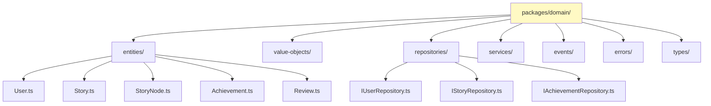

### Application Layer (`/packages/application/`)

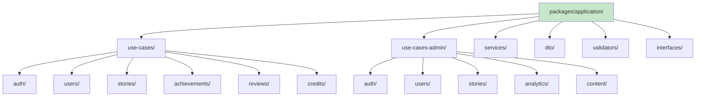

### Infrastructure Layer (`/packages/infrastructure/`)

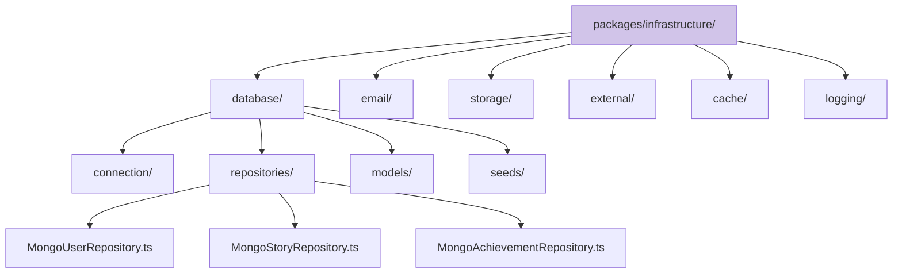

### Presentation Layer (`/packages/presentation/`)

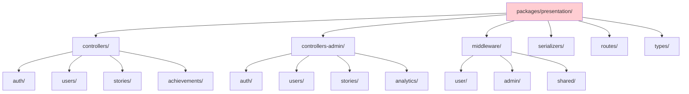

### Shared Layer (`/packages/shared/`)

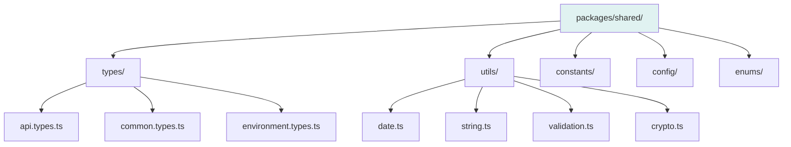

---

## 🔧 Next.js API Architecture

### API Routes Structure

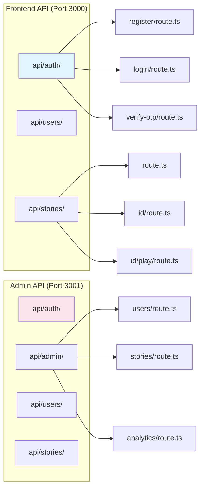

### Middleware Implementation

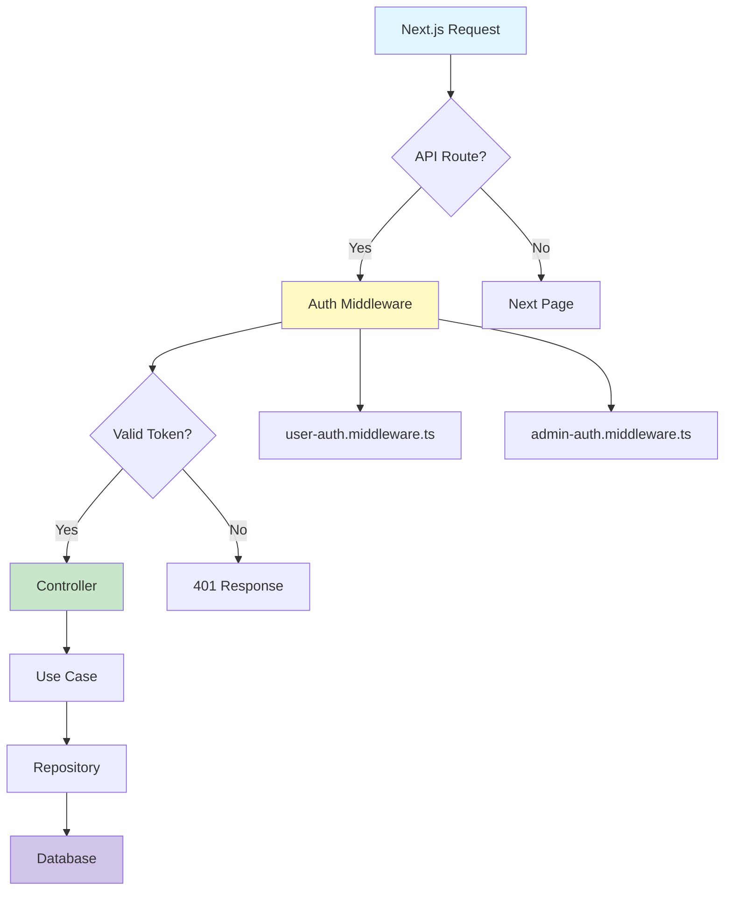

---

## 🔒 Security Architecture

### Separate User & Admin Systems

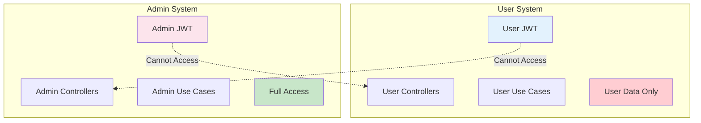

### Benefits of Complete Separation

✅ **Attack Surface Isolation** - Separate JWT keys prevent token reuse
✅ **Permission Boundaries** - No accidental privilege escalation
✅ **Audit & Compliance** - Separate trails for users and admins
✅ **Independent Scaling** - Systems can scale differently
✅ **Testing Isolation** - Independent test suites

---

## 🧪 Testing Strategy

### Testing Pyramid

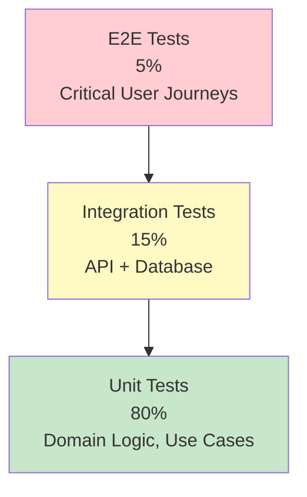

### Test Structure

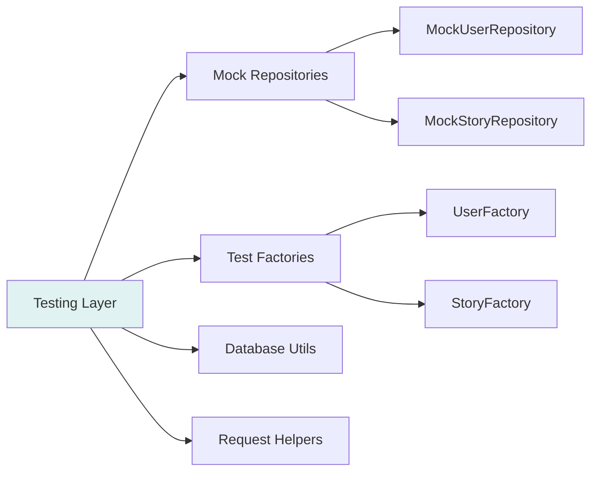

---

## 📋 Implementation Steps

### Phase 1: Core Structure (Week 1)

```bash
# Create packages structure
mkdir -p packages/{domain,application,infrastructure,presentation,shared,testing}

# Add package.json files
npm init -y -w packages/domain
npm init -y -w packages/application
# ... etc

# Configure TypeScript paths
# Create initial domain entities
```

### Phase 2: Development Setup (Week 1)

```bash
# Install dependencies
npm install mongoose @types/mongoose -w packages/infrastructure
npm install jsonwebtoken @types/jsonwebtoken -w packages/infrastructure
npm install zod -w packages/application

# Set up database connection
# Create basic middleware
```

### Phase 3: Feature Development (Week 2+)

```bash
# Add models incrementally
# Add use cases as needed
# Implement controllers
# Add API routes
```

---

## 🎯 Benefits

### ✅ Code Reuse
- Shared business logic across apps
- Single source of truth for models
- Consistent authentication and validation

### ✅ Scalability
- Easy to add new packages
- Clear separation of concerns
- Parallel team development

### ✅ Maintainability
- Centralized type definitions
- Consistent patterns
- Easy to update shared logic

### ✅ Development Speed
- Reusable components
- Clear boundaries
- Fast iteration

---

## 🔧 Configuration Examples

### Root package.json
```json
{
  "name": "talepick",
  "private": true,
  "workspaces": ["apps/*", "packages/*"],
  "scripts": {
    "dev": "npm run dev --workspaces",
    "build": "npm run build --workspaces",
    "test": "npm run test --workspaces",
    "lint": "npm run lint --workspaces"
  }
}
```

### TypeScript Path Aliases
```json
{
  "compilerOptions": {
    "paths": {
      "@shared/domain": ["packages/domain"],
      "@shared/application": ["packages/application"],
      "@shared/infrastructure": ["packages/infrastructure"],
      "@shared/presentation": ["packages/presentation"],
      "@shared/shared": ["packages/shared"]
    }
  }
}
```

---

*This simplified structure supports phased development while maintaining flexibility for growth, with comprehensive testing and security at every layer.*