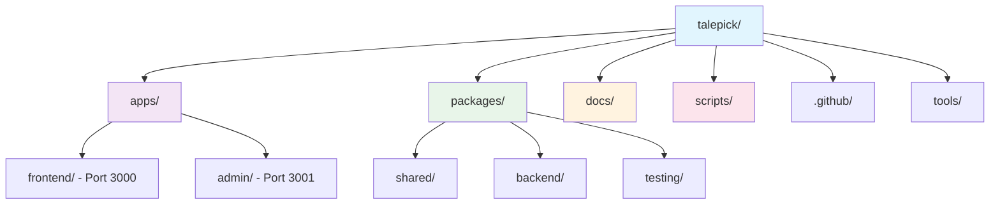
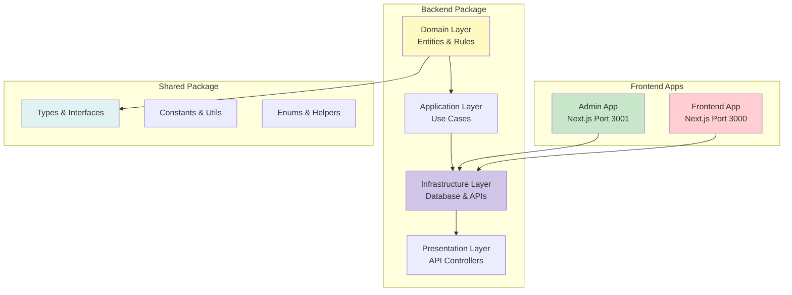
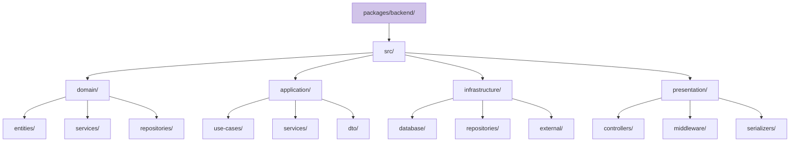
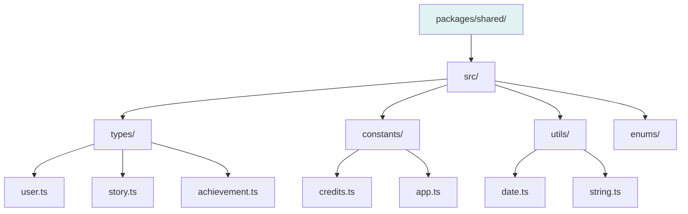
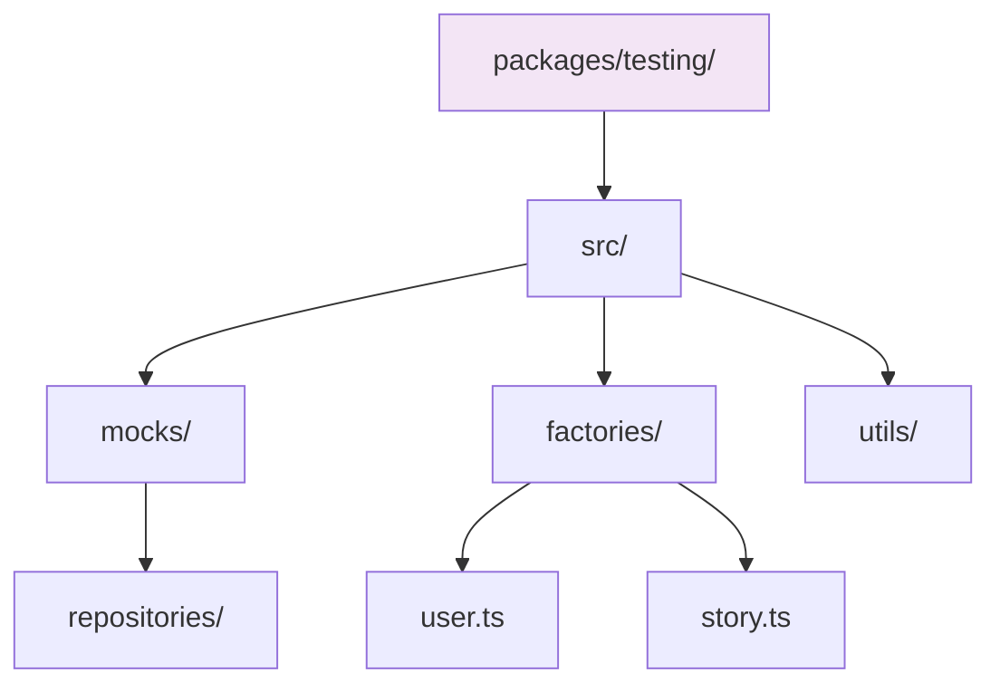
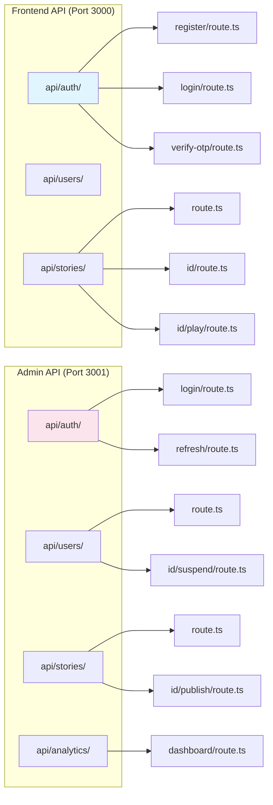
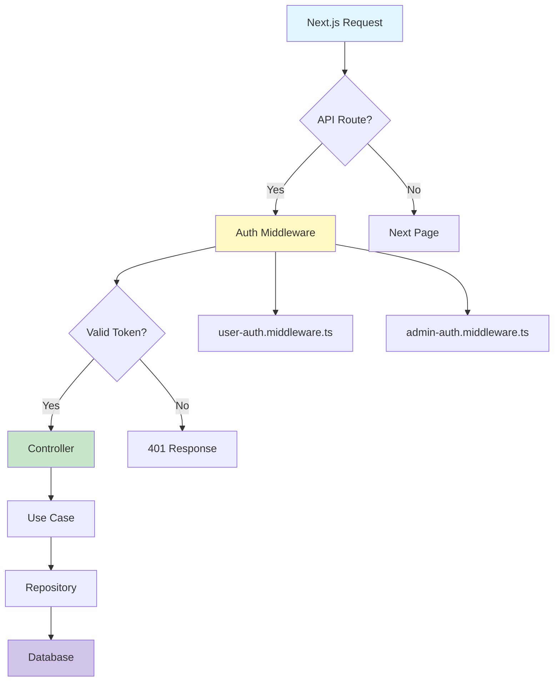
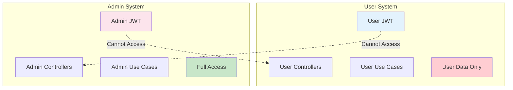
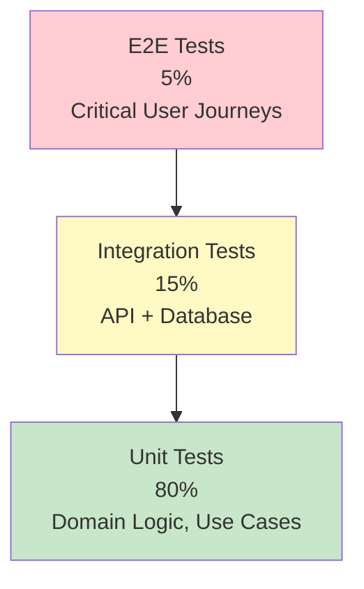
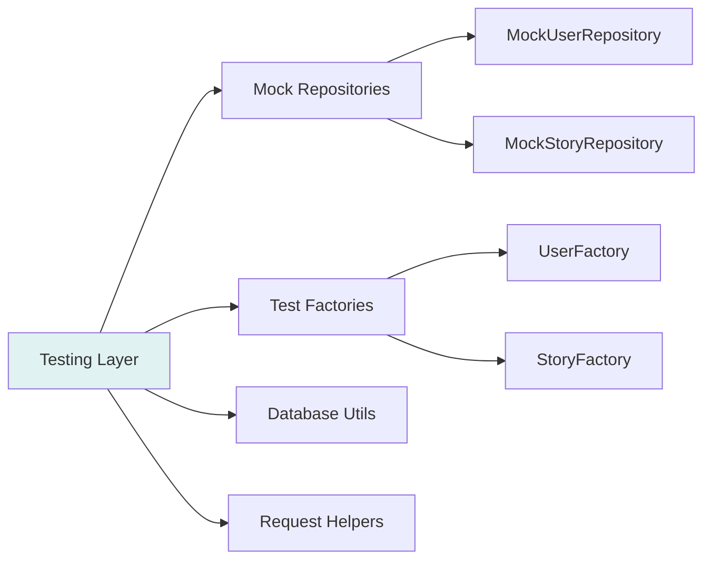

# TalePick Folder Structure Design

> **Next.js 16 Monorepo** • Simplified Clean Architecture • Backend-Only Logic • MongoDB • 2025

---

## 📁 Root Directory Structure



---

## 🏗️ Simplified Architecture Overview



---

## 📂 Apps Structure

### Frontend App (`/apps/frontend/`)

```mermaid
graph LR
    A[apps/frontend/] --> B[public/]
    A --> C[app/]
    A --> D[test/]

    C --> C1[layout.tsx]
    C --> C2[page.tsx]
    C --> C3[(auth)/]
    C --> C4[(story)/]
    C --> C5[lib/]
    C --> C6[ui/]
    C --> C7[api/]

    C3 --> C3a[login/]
    C3 --> C3b[signup/]
    C3 --> C3c[forgot-password/]

    C4 --> C4a[library/]
    C4 --> C4b[play/]

    C7 --> C7a[auth/]
    C7 --> C7b[stories/]
    C7 --> C7c[users/]

    style A fill:#e3f2fd
```

### Admin App (`/apps/admin/`)

```mermaid
graph LR
    A[apps/admin/] --> B[public/]
    A --> C[app/]
    A --> D[test/]

    C --> C1[layout.tsx]
    C --> C2[page.tsx]
    C --> C3[(auth)/]
    C --> C4[dashboard/]
    C --> C5[users/]
    C --> C6[stories/]
    C --> C7[reviews/]
    C --> C8[analytics/]
    C --> C9[lib/]
	    C --> C10[ui/]
	    C --> C11[api/]

	    C11 --> C11a[auth/]
	    C11 --> C11b[users/]
	    C11 --> C11c[stories/]
	    C11 --> C11d[analytics/]

	    style A fill:#fce4ec
```

---

## 📦 Simplified Package Structure

### Backend Package (`/packages/backend/`) - All Business Logic



### Shared Package (`/packages/shared/`) - Types & Utilities



### Testing Package (`/packages/testing/`)



---

## 🔧 Next.js API Architecture

### API Routes Structure



### Middleware Implementation



---

## 🔒 Security Architecture

### Separate User & Admin Systems



### Benefits of Complete Separation

✅ **Attack Surface Isolation** - Separate JWT keys prevent token reuse
✅ **Permission Boundaries** - No accidental privilege escalation
✅ **Audit & Compliance** - Separate trails for users and admins
✅ **Independent Scaling** - Systems can scale differently
✅ **Testing Isolation** - Independent test suites

---

## 🧪 Testing Strategy

### Testing Pyramid



### Test Structure



---

## 📋 Implementation Steps

### Phase 1: Core Structure (Week 1)

```bash
# Create simplified packages structure
mkdir -p packages/{shared,backend,testing}

# Add package.json files
npm init -y -w packages/shared
npm init -y -w packages/backend
npm init -y -w packages/testing

# Configure TypeScript paths
# Create shared types and constants
```

### Phase 2: Development Setup (Week 1)

```bash
# Install dependencies
npm install zod -w packages/shared
npm install mongoose jsonwebtoken bcryptjs -w packages/backend
npm install vitest @testing-library/react -w packages/testing

# Set up database connection in backend package
# Create initial domain entities
# Set up basic API controllers
```

### Phase 3: Feature Development (Week 2+)

```bash
# Add use cases incrementally
# Implement repositories in backend
# Add API routes in apps
# Create test utilities
```

---

## 🎯 Benefits

### ✅ Code Reuse
- Shared business logic across apps
- Single source of truth for models
- Consistent authentication and validation

### ✅ Scalability
- Easy to add new packages
- Clear separation of concerns
- Parallel team development

### ✅ Maintainability
- Centralized type definitions
- Consistent patterns
- Easy to update shared logic

### ✅ Development Speed
- Reusable components
- Clear boundaries
- Fast iteration

---

## 🔧 Configuration Examples

### Root package.json
```json
{
  "name": "talepick",
  "private": true,
  "workspaces": ["apps/*", "packages/*"],
  "scripts": {
    "dev": "npm run dev --workspaces",
    "build": "npm run build --workspaces",
    "test": "npm run test --workspaces",
    "lint": "npm run lint --workspaces"
  }
}
```

### TypeScript Path Aliases
```json
{
  "compilerOptions": {
    "paths": {
      "@talepick/shared": ["packages/shared"],
      "@talepick/backend": ["packages/backend"],
      "@talepick/testing": ["packages/testing"]
    }
  }
}
```

### Package Dependencies Example
```json
// packages/shared/package.json
{
  "name": "@talepick/shared",
  "main": "dist/index.js",
  "dependencies": {
    "zod": "^4.1.13"
  }
}

// packages/backend/package.json
{
  "name": "@talepick/backend",
  "main": "dist/index.js",
  "dependencies": {
    "@talepick/shared": "workspace:*",
    "mongoose": "^8.0.0",
    "jsonwebtoken": "^9.0.0",
    "bcryptjs": "^2.4.3"
  }
}

// apps/frontend/package.json
{
  "dependencies": {
    "@talepick/shared": "workspace:*",
    "@talepick/testing": "workspace:*"
  }
}
```

---

*This simplified structure reduces complexity while maintaining clean architecture principles. Business logic stays in the backend, frontend consumes APIs, and shared types ensure consistency across the entire application.*
