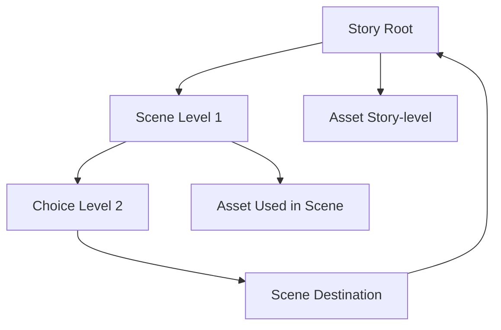
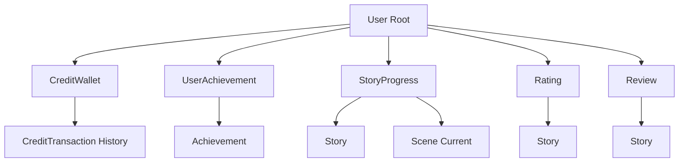

# Domain Model Specification (Stage 2) - Part 5: Domain Relationships

## 5. DOMAIN RELATIONSHIPS

### Primary Relationships (ความสัมพันธ์หลัก)

| Entity | Relationship Type | Target Entity | Cardinality | Description |
|--------|-------------------|---------------|-------------|-------------|
| User | ครอบครอง | CreditWallet | 1:1 | ผู้ใช้มีกระเป๋าเครดิตหนึ่งใบ |
| User | ได้รับ | UserAchievement | 1:many | ผู้ใช้สามารถได้ความสำเร็จได้หลายอย่าง |
| User | สร้าง | StoryProgress | 1:many | ผู้ใช้สามารถมีเซสชันเรื่องได้หลายเซสชัน |
| User | เขียน | Review | 1:many | ผู้ใช้สามารถเขียนรีวิวได้หลายรายการ |
| User | ให้ | Rating | 1:many | ผู้ใช้สามารถจัดอันดับเรื่องได้หลายเรื่อง |
| User | มี | Avatar | many:many | ผู้ใช้สามารถปลดล็อกอวาตาร์ได้หลายอัน |
| GuestUser | มี | CreditWallet | 1:1 | ผู้มาเยี่ยมมีกระเป๋าเครดิตชั่วคราว |
| GuestUser | สร้าง | StoryProgress | 1:many | ผู้มาเยี่ยมสามารถมีเซสชันเรื่องได้ |
| Story | มี | Scene | 1:many | เรื่องมีหลายฉาก |
| Scene | มี | Choice | 1:many | ฉากมีตัวเลือกขาออกหลายตัว |
| Choice | เชื่อมต่อ | Scene | many:1 | ตัวเลือกเชื่อมต่อไปยังฉากปลายทาง |
| Story | ได้รับ | Rating | 1:many | เรื่องสามารถมีการจัดอันดับได้หลายครั้ง |
| Story | ได้รับ | Review | 1:many | เรื่องสามารถมีรีวิวได้หลายรายการ |
| Achievement | ให้รางวัล | UserAchievement | 1:many | ความสำเร็จที่ผู้ใช้ได้รับหลายคน |
| Achievement | ปลดล็อก | Avatar | 1:1 | ความสำเร็จอาจปลดล็อกอวาตาร์ |
| AdminUser | ดำเนินการ | ModerationAction | 1:many | ผู้ดูแลระบบดำเนินการตรวจสอบ |

### Relationship Hierarchies (ลำดับชั้นความสัมพันธ์)

#### โครงสร้างลำดับชั้นเรื่อง

#### ลำดับชั้นความคืบหน้าผู้ใช้

### Ownership vs Reference Relationships (ความเป็นเจ้าของ vs การอ้างอิง)

#### Ownership (Cascade Delete - การลบต่อเนื่อง)
- User → CreditWallet
- User → UserAchievement
- Story → Scene
- Scene → Choice
- Achievement → UserAchievement (when user deleted)

#### Reference (No Cascade Delete - อ้างอิงไม่ลบต่อเนื่อง)
- Choice → Scene (destination)
- UserAchievement → Achievement
- Rating → Story
- Review → Story
- Asset → Story/Scene (many references)

### Relationship Notes (โน้ตความสัมพันธ์)

#### Deletion Rules (กฎการลบ)
- **Cascade**: การลบผู้ใช้จะลบกระเป๋าเงิน ความสำเร็จ ความคืบหน้า
- **Soft Delete**: เรื่องและฉากเก็บถาวร ไม่ลบ (เก็บวิเคราะห์)
- **Restrict**: ไม่สามารถลบความสำเร็จที่เป็นข้อกำหนดสำหรับอื่น
- **Set Null**: การลบผู้ใช้จะตั้งค่าผู้ใช้รีวิว/การจัดอันดับเป็น null (เก็บเนื้อหา)

#### Publishing Dependencies (การพึ่งพาการเผยแพร่)
- เรื่องที่เผยแพร่ไม่สามารถมีการเชื่อมต่อฉากที่ไม่ถูกต้อง
- ฉากทั้งหมดในเรื่องที่เผยแพร่ต้องเข้าถึงได้
- เรื่องที่เผยแพร่ต้องการอย่างน้อยหนึ่งจุดสิ้นสุดที่ถูกต้อง
- การใช้งานสื่อติดตาม; ไม่สามารถลบสื่อที่ใช้ในเรื่องที่เผยแพร่

#### Visibility Scoping (ขอบเขตการมองเห็น)
- **User-visible**: ข้อมูลเมตาเรื่อง การจัดอันดับ รีวิวสาธารณะ ความสำเร็จ
- **Owner-only**: ยอดเงินเครดิต ความคืบหน้าส่วนตัว สถานะความสำเร็จ
- **Admin-only**: การวิเคราะห์ ข้อมูลการตรวจสอบ การกำหนดค่าระบบ
- **Guest-limited**: ไม่มีข้อมูลถาวร จำกัดเครดิต ไม่มีฟีเจอร์สังคม