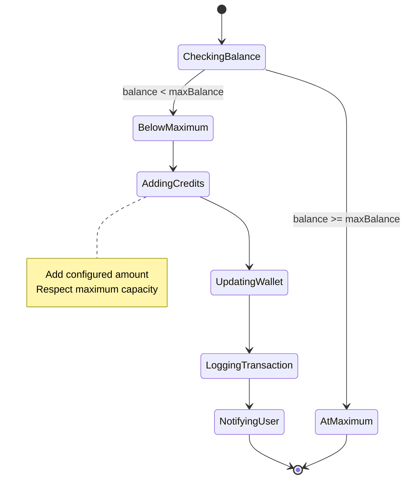
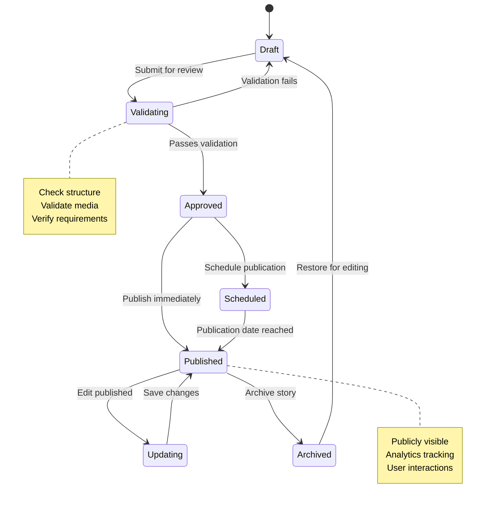
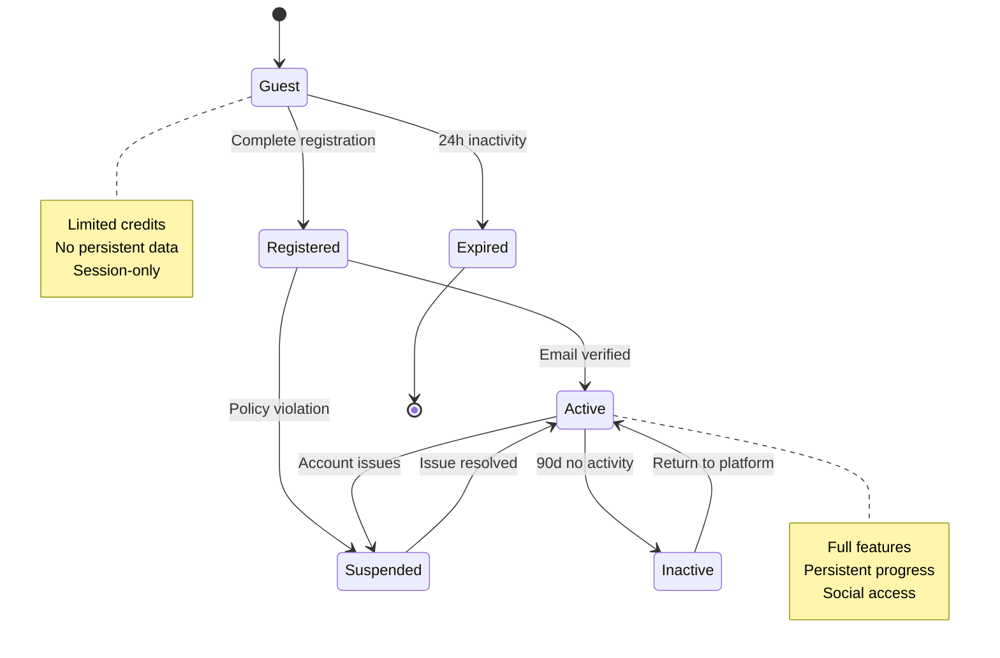
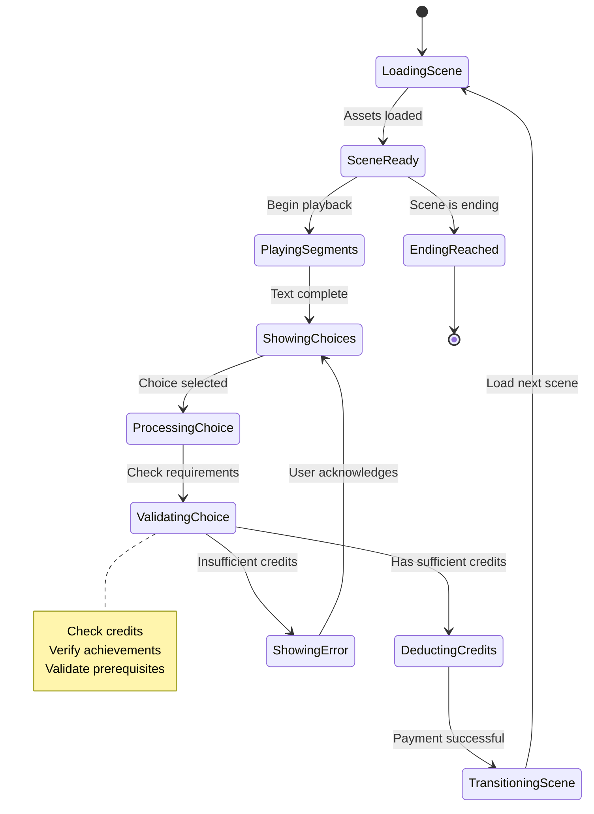
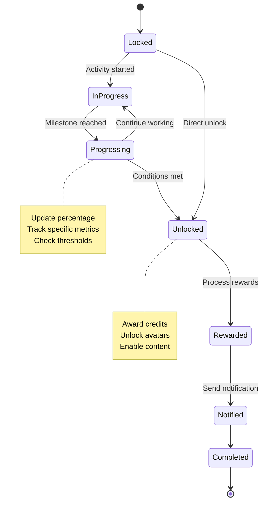
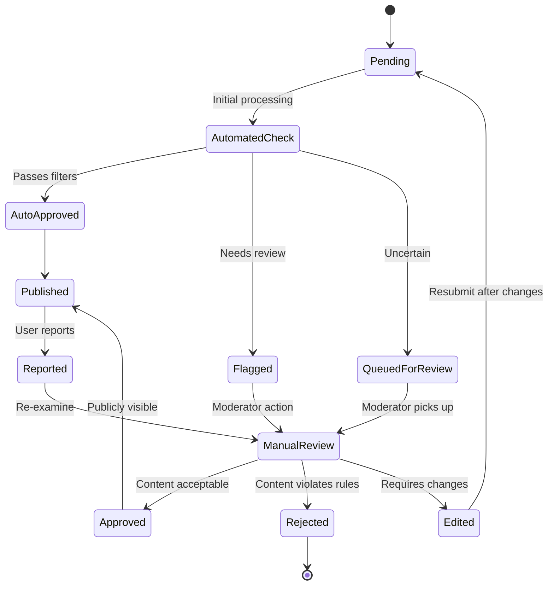

# Domain Model Specification (Stage 2) - Part 8: State Machines

## 8. DOMAIN STATE MACHINES (For key flows)

### Credit Refill State Machine (เครื่องจัดสถานะการเติมเต็มเครดิต)

### Story Lifecycle State Machine (เครื่องจัดสถานะวงจรชีวิตเรื่อง)

### User Session State Machine (เครื่องจัดสถานะเซสชันผู้ใช้)

### Scene Navigation State Machine (เครื่องจัดสถานะการนำทางฉาก)

### Achievement Progress State Machine (เครื่องจัดสถานะความคืบหน้าความสำเร็จ)

### Review Moderation State Machine (เครื่องจัดสถานะการตรวจสอบรีวิว)
